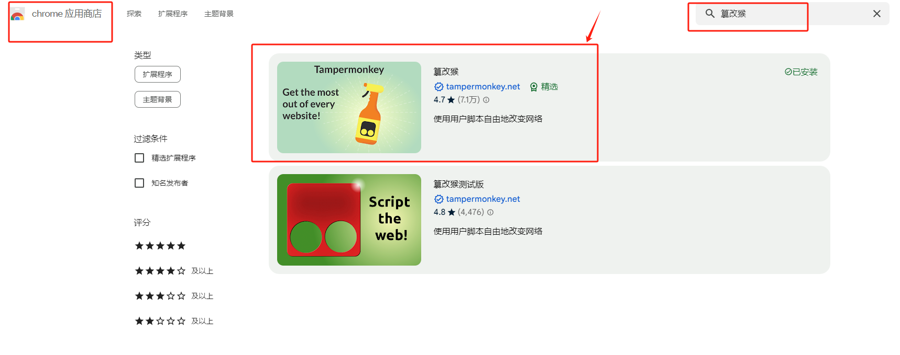
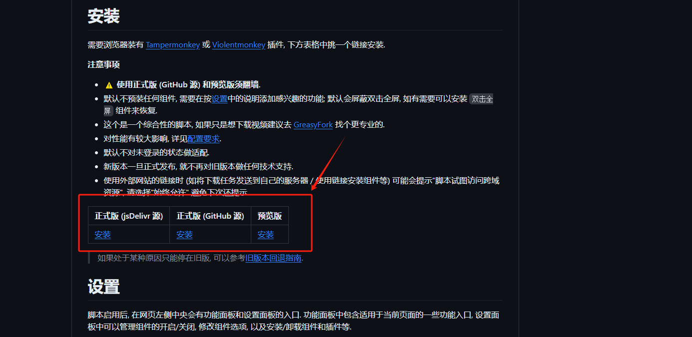
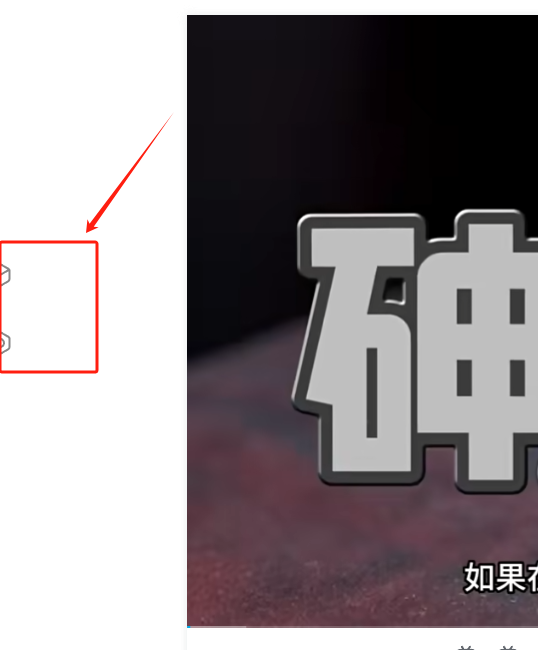
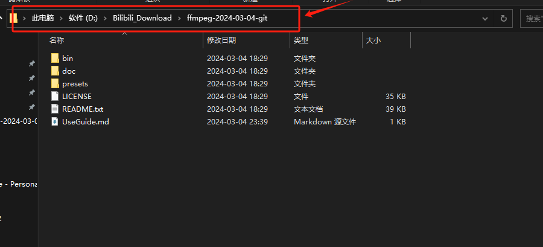
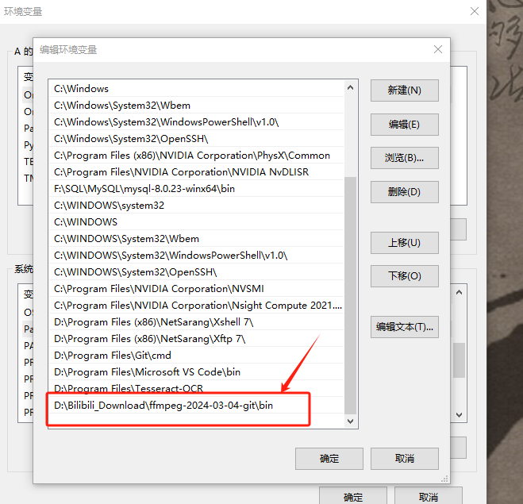
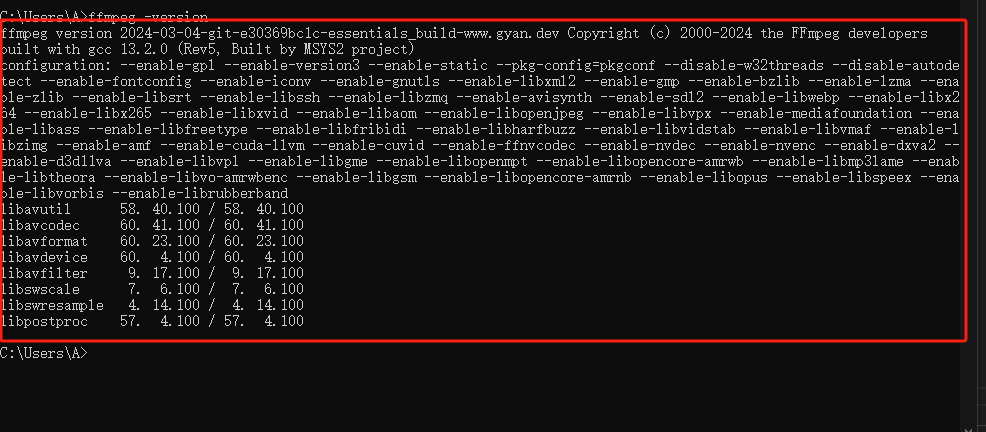
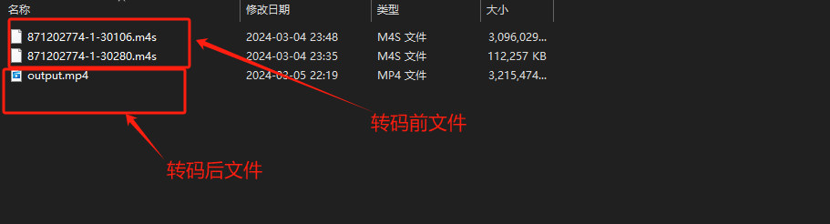

# Bilibili-Evolved
插件GitHub：https://github.com/the1812/Bilibili-Evolved

注意: 
- 使用插件时需要先安装油猴插件(篡改猴),故需要会魔法上网;
- 此方式下载的视频均为m4s格式,需要借助工具进行转码;
- 下载的视频还是有B站的水印,待后续更新对应教程;

## 安装篡改猴脚本
打开谷歌应用商店,搜索安装即可

## 安装Bilibili-Evolved
打开项目地址,任选其一点击即可自动安装

## 使用
安装成功后，打开任意B站视频页码，左边出现如下(目前还不会有下载功能)

### 安装所需功能
点击设置,按照下述步骤即可安装所需的插件,如下载

### 使用功能
打开视频的播放页,点击功能,即可看到已安装的对应功能,点击即可使用

### 下载
- 点击下载后如下,自行选择格式,分辨率等

- 根据需要点击对应的视频或者音频链接即可下载

## 视频转码
使用 ffmpeg 工具进行转码

### 下载ffmpeg
- 官网: https://ffmpeg.org/

- 见目录中提供的包

### 安装ffmpeg
* 将下载的zip解压,记住解压路径

* 设置环境变量
将上述解压路径+bin路径,添加到环境变量中

* 测试是否可用
使用管理员权限打开cmd,使用命令：ffmpeg -version ,未报错即可用

### 转码
使用管理员权限打开cmd, 使用 cd 命令切换至已下载的音视频目录,使用命令：

ffmpeg -i 1.m4s -i 2.m4s -c copy output.mp4 (自行替换对应m4s及MP4文件名)

